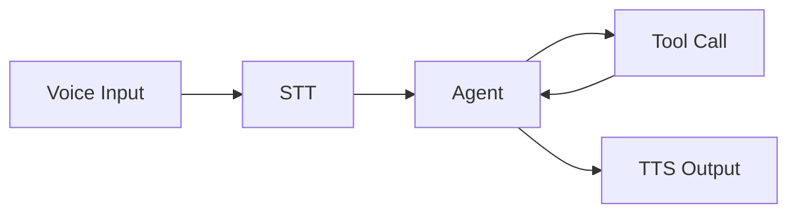

--- 
icon: lucide/package-check
--- 

# AI Voice Assistant

## Overview

Built a real-time voice assistant with conversational memory and tool-based reasoning.

## Responsibilities

* Integrated STT (speech-to-text) and TTS (text-to-speech)
* Implemented conversational memory
* Enabled tool-based responses

## Architecture

## Tech

`Whisper` · `OpenAI` · `TTS`

## Impact

* Enabled natural voice interaction
* Demonstrated real-time agent system capability
