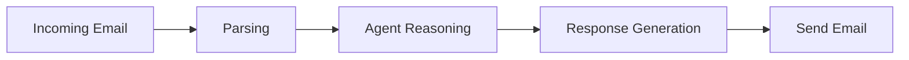

--- 
icon: lucide/package-check
--- 

# Email Automation Agent

## Overview

Built an AI agent to read, classify, and respond to emails automatically.

## Responsibilities

* Parsed incoming emails
* Classified intent and priority
* Generated and sent responses

## Pipeline

## Tech

`OpenAI` · `APIs`

## Impact

* Automated repetitive communication workflows
* Improved response speed and consistency
