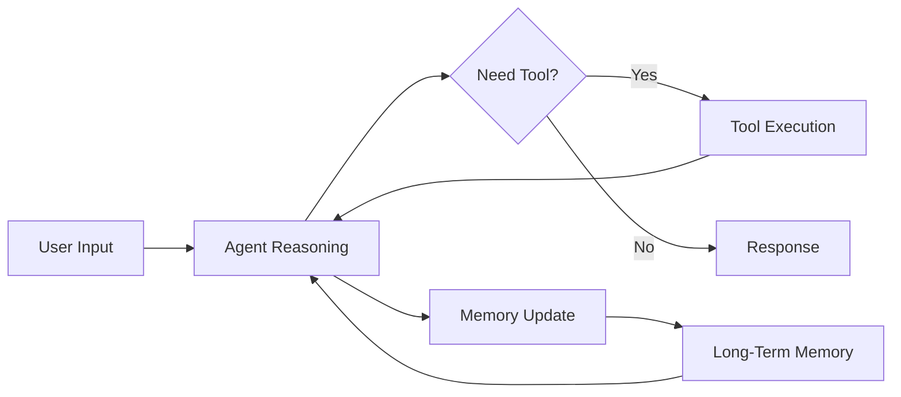

--- 
hide:
  - footer

icon: lucide/bot
---  

# :lucide-bot: AI Agents

**Period:** 2025 – Present  
**Scope:** AI Agents · Autonomous Systems · LLM Orchestration  
**Tools:** OpenAI · Anthropic · Google AI · LangChain · LlamaIndex · PydanticAI · FastAPI · Docker  

## Overview

Design and development of **autonomous AI agent systems** capable of reasoning, memory management, tool execution, and multi-step task completion.

Focus on building **production-ready AI systems** that combine:

* reasoning (LLMs)
* memory (short-term & long-term)
* action (tool execution)
* orchestration (multi-agent systems)

## System Architecture

## Key Contributions

* Designed **multi-agent orchestration systems** for complex task execution
* Built **persistent memory architectures** for long-context reasoning
* Developed **tool-augmented agents** for real-world task automation
* Integrated **voice, text, and API-based interaction layers**
* Deployed scalable systems using **FastAPI and containerized services**

## Works

* [AI Voice Assistant](ai-voice-assistant.md)
* [Voice Call Agent](voice-call-agent.md)
* [Email Automation Agent](email-agent.md)
* [Multi-Agent Orchestration](multi-agent-orchestration.md)
* [Persistent Memory System](persistent-memory.md)

## Tech Focus

`Agents` · `Tool Calling` · `Memory Systems` · `RAG` · `FastAPI` · `Docker`

## Impact

* Delivered **autonomous systems capable of multi-step reasoning and action**
* Reduced manual workflows through **AI-driven automation**
* Improved reliability with **memory + retrieval integration**
* Built scalable architectures for **real-world deployment**

## Challenges

* Managing **context window limitations** with long-term memory
* Balancing **latency vs reasoning depth**
* Ensuring **tool reliability and error handling**
* Reducing hallucination with **RAG + validation strategies**
