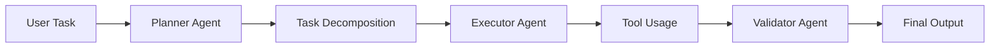

--- 
icon: lucide/package-check
--- 

# Multi-Agent Orchestration

## Overview

Designed a system where multiple AI agents collaborate to solve complex tasks through role-based decomposition.

## Responsibilities

* Defined agent roles (planner, executor, validator)
* Implemented communication protocols
* Managed task orchestration

## Architecture

## Tech

`OpenAI` · `LangChain`

## Impact

* Enabled complex task solving via agent collaboration
* Improved modularity and scalability of AI systems
