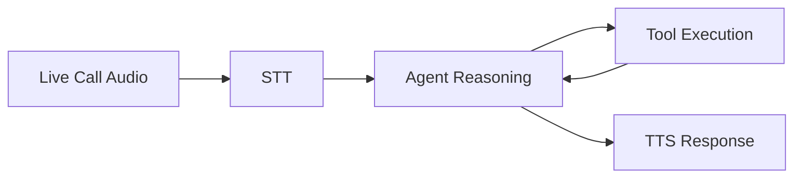

--- 
icon: lucide/package-check
--- 

# Voice Call Agent

## Overview

Developed an AI agent capable of handling real-time voice calls with dynamic responses and task execution.

## Responsibilities

* Processed live call audio streams
* Generated context-aware responses
* Integrated backend tools for task execution

## Pipeline

## Tech

`OpenAI` · `Whisper` · `Telephony API`

## Impact

* Automated call handling workflows
* Reduced need for human operators
