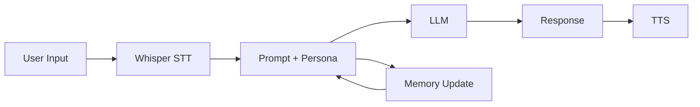

--- 
icon: lucide/package-check
---  

# Persona Chat System

## Overview

Developed a conversational AI system with configurable personas and persistent memory.

## Responsibilities

* Designed persona-driven prompt templates
* Implemented chat memory with summarization
* Integrated voice interaction (STT + TTS)

## Approach

* Prompt engineering for persona behavior
* Chat history summarization
* Multimodal interaction

### Architecture

## Tech

`OpenAI` · `Whisper` · `ElevenLabs` · `HuggingFace`

## Impact

* Created human-like conversational agents
* Enabled persistent personality and context
* Demonstrated multimodal AI interaction
