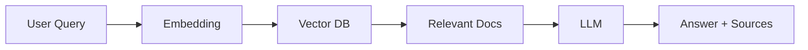

--- 
icon: lucide/package-check
---  

# RAG Document Assistant

## Overview

Built a retrieval-augmented chatbot for querying documents with source attribution.

## Responsibilities

* Implemented document ingestion pipeline
* Built vector search system
* Designed answer + citation output

## Approach

* Embedding-based retrieval
* Context injection into prompts
* Source-grounded answering

### Architecture

## Tech

`OpenAI` · `Vector DB`

## Impact

* Improved answer accuracy with grounding
* Enabled explainable AI responses
* Reduced hallucination risk
