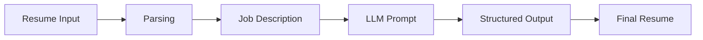

--- 
icon: lucide/package-check
---  

# Resume Tailoring Engine

## Overview

Generated job-specific resumes from raw input and job descriptions using structured prompting.

## Responsibilities

* Parsed PDF/DOC resumes
* Designed structured output prompts
* Integrated Gemini API

## Approach

* Prompt engineering for structured JSON output
* Context alignment with job descriptions
* Resume rewriting pipeline

### Pipeline

## Tech

`Gemini API` · `Streamlit`

## Impact

* Automated resume optimization
* Improved job matching relevance
* Reduced manual editing effort
