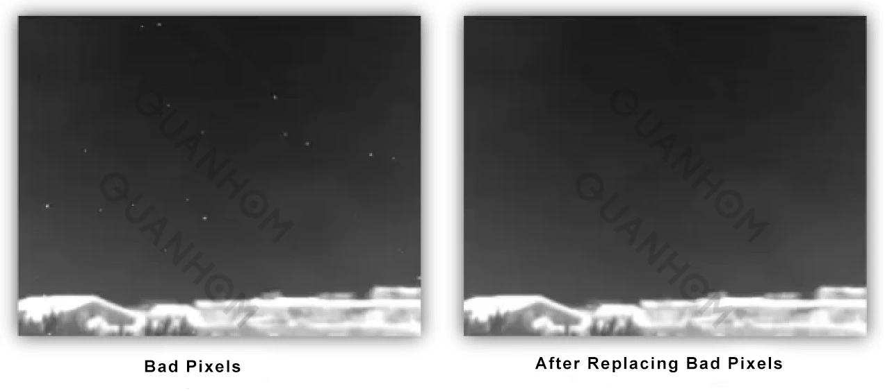
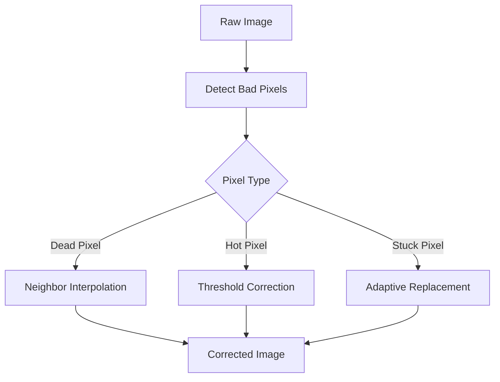

---
icon: lucide/package-check
--- 

# Bad Pixel Replacement (BPR)

## Overview

Designed methods to detect and replace defective pixels in image sensors.

## Responsibilities

* Identified dead, hot, and stuck pixels
* Developed interpolation-based correction methods
* Integrated real-time correction strategies

## Approach

* Threshold-based detection
* Neighborhood interpolation
* Adaptive replacement strategies

### Bad Pixel Handling Flow

### Tech

`MATLAB` · `Image Processing`

## Impact

* Eliminated visual artifacts caused by defective pixels
* Improved perceived image quality
* Increased robustness of camera output

