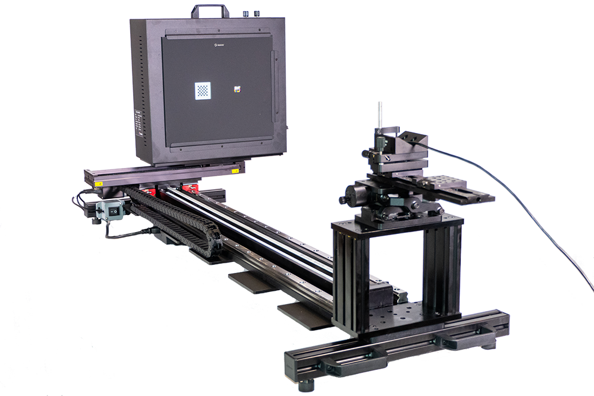
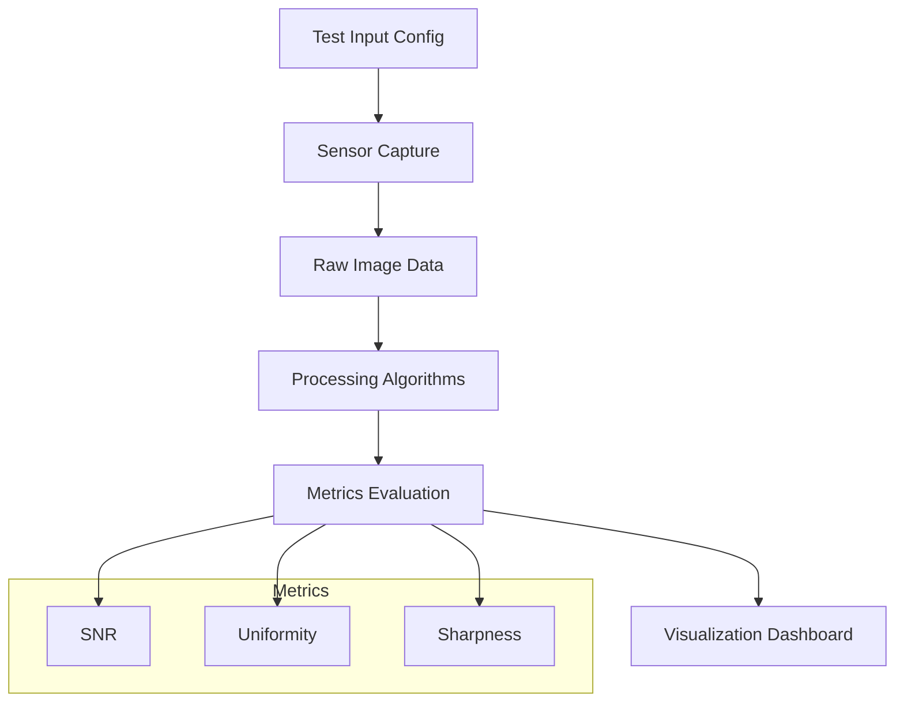

# Camera & Sensor Test Bench

## Overview

Developed a testing framework for evaluating camera sensors and image processing algorithms under controlled conditions.

## Responsibilities

* Designed test workflows for **sensor characterization**
* Implemented tools for **capturing and analyzing raw image data**
* Automated evaluation of image quality metrics

## System Architecture

### Key Features

* Controlled input scenarios (lighting, exposure, noise)
* Batch processing of test images
* Visualization tools for analysis

### Tech

`MATLAB` · `Image Analysis` · `Data Visualization`

## Impact

* Enabled systematic benchmarking of camera performance
* Accelerated development and validation of ISP algorithms
* Improved reproducibility of testing workflows

