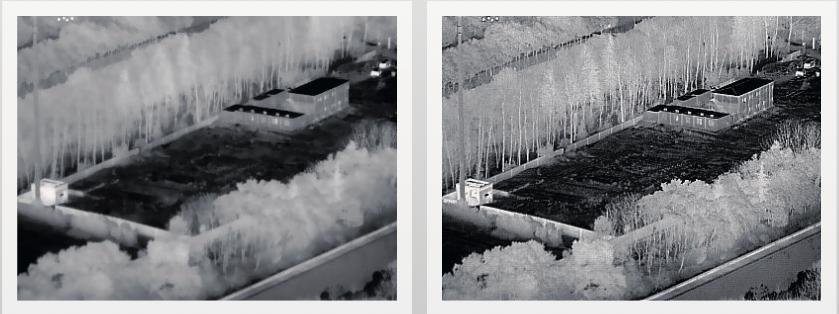
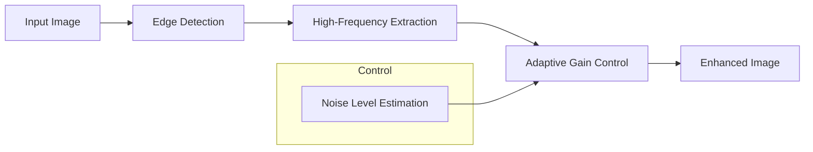

---
icon: lucide/package-check
--- 

# Digital Detail Enhancement (DDE)

## Overview

Developed algorithms to enhance fine details and edges in images while minimizing noise amplification.

## Responsibilities

* Designed edge enhancement filters
* Balanced sharpness vs noise trade-offs
* Tuned parameters for different imaging conditions

## Approach

* High-frequency boosting
* Edge-aware filtering
* Adaptive enhancement strength

### Enhancement Pipeline

### Tech

`MATLAB` · `Filtering` · `Image Enhancement`

## Impact

* Improved perceived sharpness of images
* Enhanced fine textures and edges
* Maintained natural image appearance

