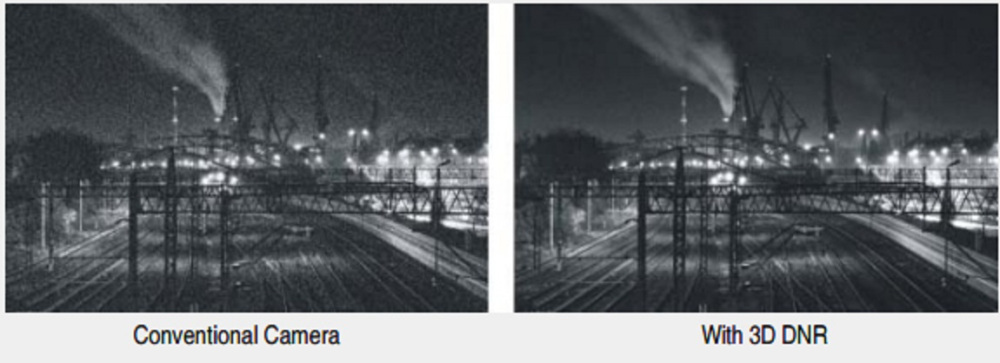
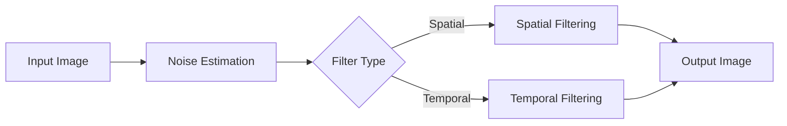

---
icon: lucide/package-check
--- 

# Digital Noise Reduction (DNR)

## Overview

Implemented noise reduction algorithms to improve image quality, especially under low-light conditions.

## Responsibilities

* Modeled noise characteristics of sensors
* Designed spatial and temporal denoising filters
* Optimized for performance and quality

## Approach

* Spatial filtering (e.g., smoothing, bilateral filtering)
* Temporal noise reduction across frames
* Noise-aware adaptive filtering

### Noise Reduction Flow

### Tech

`MATLAB` · `Signal Processing` · `Image Filtering`

## Impact

* Reduced visible noise in challenging conditions
* Improved low-light performance
* Enhanced downstream computer vision reliability

