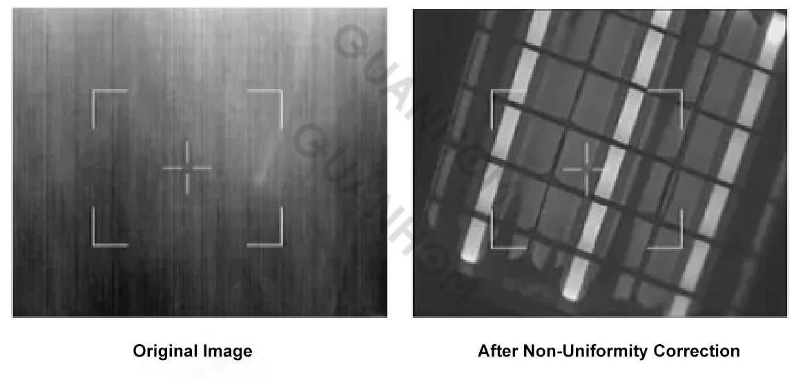
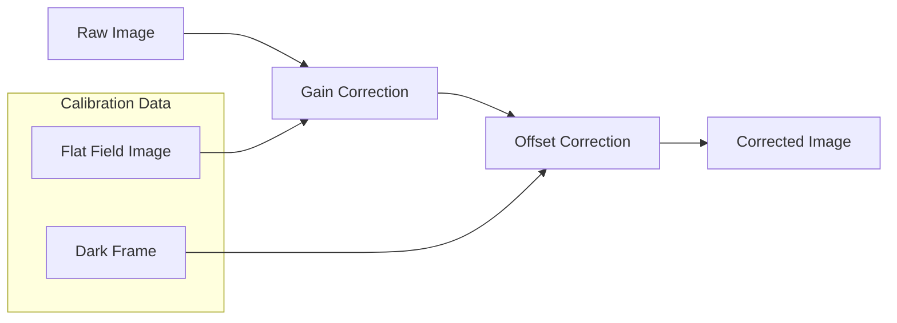

# Non-Uniformity Correction (NUC)

## Overview

Implemented algorithms to correct pixel-wise response variations in image sensors, improving image uniformity.

## Responsibilities

* Modeled sensor non-uniformity characteristics
* Developed correction algorithms using calibration data
* Integrated correction into image processing pipeline

## Approach

* Gain and offset correction per pixel
* Calibration using reference frames
* Optimization for computational efficiency

### Correction Pipeline

### Tech

`MATLAB` · `Signal Processing` · `Calibration Algorithms`

## Impact

* Significantly reduced fixed-pattern noise
* Improved visual consistency across frames
* Enhanced downstream processing reliability

