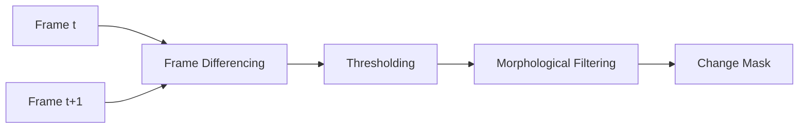
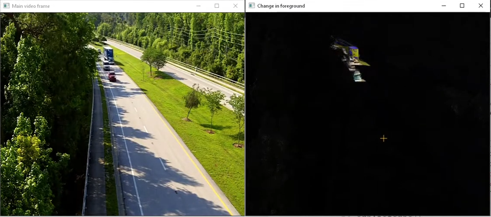

--- 
icon: lucide/package-check
--- 

# Change Detection

## Overview

Developed algorithms to detect scene changes across frames for surveillance and monitoring applications.

## Responsibilities

* Designed frame differencing pipelines
* Handled illumination variations and noise
* Reduced false positives using post-processing

## Approach

* Frame differencing
* Background modeling
* Morphological filtering

### Pipeline

### Tech

`OpenCV` · `NumPy`

## Impact

* Enabled reliable detection of motion and scene changes
* Reduced noise-induced false detections
* Improved robustness under varying lighting conditions

