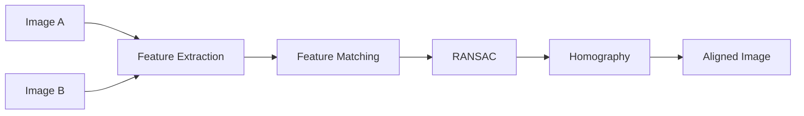
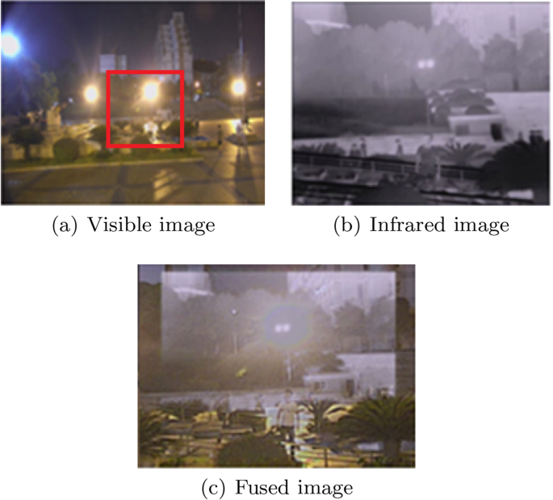

--- 
icon: lucide/package-check
tags:
    - Image Fusion
--- 

# Feature Matching & Image Registration

## Overview

Implemented feature-based image alignment for matching and registering images (image fusion) under geometric transformations.

## Responsibilities

* Extracted robust keypoints and descriptors
* Matched features across images
* Estimated transformation using RANSAC

## Approach

* Keypoint detection (ORB/SIFT-like)
* Descriptor matching
* Homography estimation

### Pipeline

### Tech

`OpenCV` · `NumPy` · `RANSAC`

## Impact

* Enabled robust alignment under viewpoint changes
* Improved accuracy of downstream vision tasks
* Built reusable geometric estimation modules

