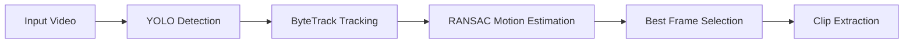
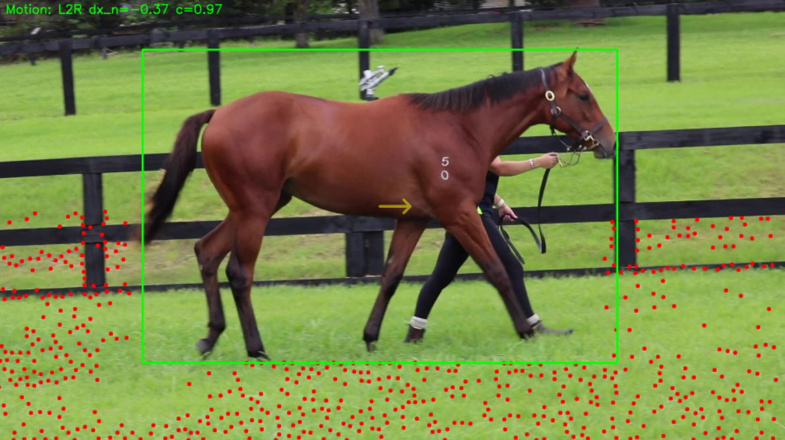

--- 
icon: lucide/package-check
--- 

# Horse Video Auto Clipper

## Overview

Developed a desktop application to automatically extract standardized clips from yearling parade videos based on horse orientation and motion.

## Responsibilities

* Detected and tracked horses using YOLO + ByteTrack
* Estimated motion direction using geometric methods
* Identified optimal frame for clip extraction

## Approach

* Object detection (YOLO)
* Multi-object tracking (ByteTrack)
* Motion estimation using RANSAC

### System Pipeline

## Tech

`OpenCV` · `RANSAC` · `YOLO` · `ByteTrack`

## Impact

* Automated manual video editing workflow
* Ensured consistent clip quality and timing
* Reduced processing time significantly

