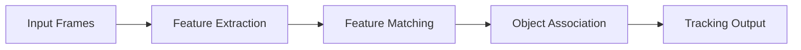
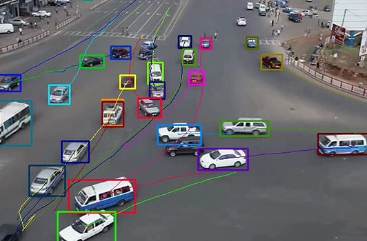

--- 
icon: lucide/package-check
--- 

# Object Detection & Tracking

## Overview

Built systems for detecting and tracking objects using feature-based methods and tracking algorithms.

## Responsibilities

* Implemented feature-based detection pipelines
* Designed multi-object tracking logic
* Optimized performance for real-time processing

## Approach

* Feature extraction (ORB/SIFT-like)
* Matching across frames
* Tracking with motion consistency

### Pipeline

### Tech

`OpenCV` · `NumPy` · `Feature Matching`

## Impact

* Achieved stable tracking across multiple frames
* Improved robustness against occlusion and motion
* Enabled downstream analytics applications

