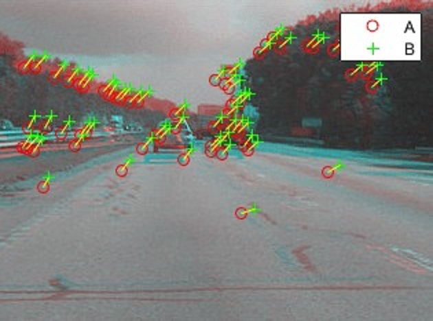

--- 
icon: lucide/package-check
--- 

# Video Stabilization & Motion Estimation

## Overview

Developed video stabilization techniques to reduce camera shake using motion estimation and smoothing.

## Responsibilities

* Estimated frame-to-frame motion
* Applied trajectory smoothing
* Warped frames to stabilize output

## Approach

* Optical flow / feature tracking
* Motion trajectory estimation
* Temporal smoothing

### Pipeline

### Tech

`OpenCV` · `NumPy` · `Optical Flow`

## Impact

* Reduced visual jitter in videos
* Improved user experience and visual quality
* Demonstrated strong understanding of motion modeling

