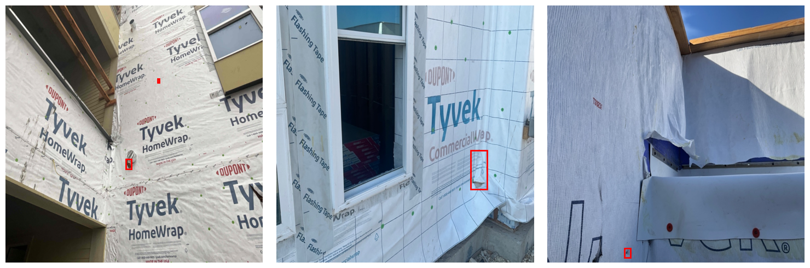
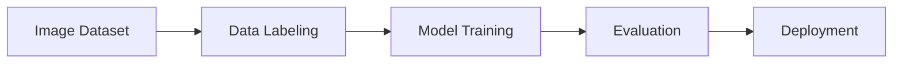

--- 
icon: lucide/package-check
--- 

# WRB Crack Detection

## Overview

Developed a building WRB crack detection model using Azure Custom Vision for industrial inspection.

## Responsibilities

* Collected and ingested dataset
* Trained and evaluated detection model
* Optimized dataset quality and labeling

## Approach

* Supervised learning
* Dataset curation
* Model evaluation

### Pipeline

### Tech

`Azure Custom Vision` · `Deep Learning`

## Impact

* Enabled automated inspection workflows
* Reduced manual inspection effort
* Improved defect detection consistency

