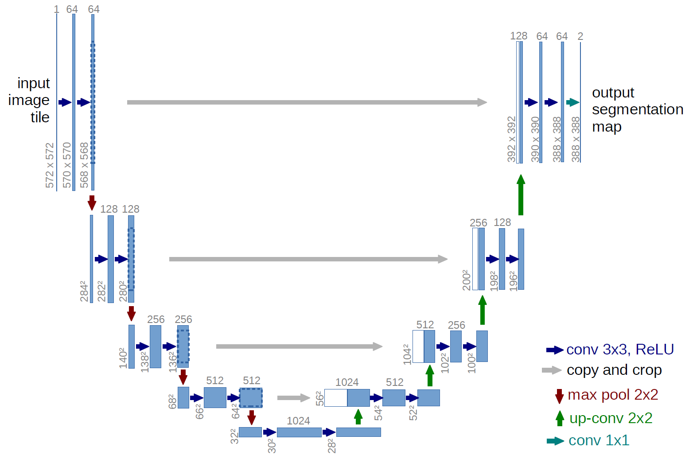
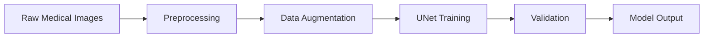
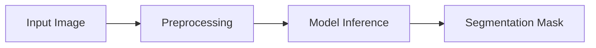
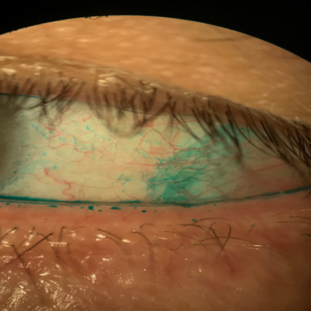
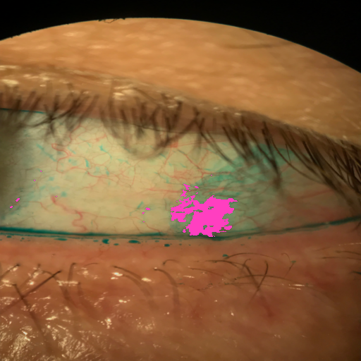
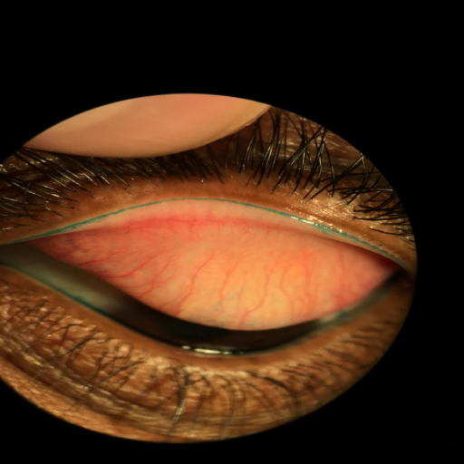
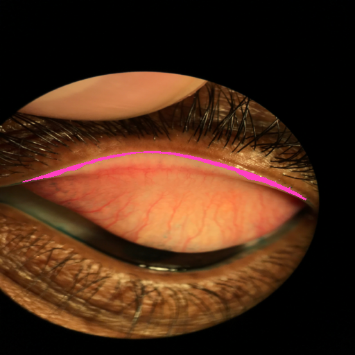

--- 
icon: lucide/package-check
--- 

# Semantic Segmentation (Medical Imaging)

## Overview

Developed a semantic segmentation model for ocular diagnosis (LG staining) images to identify affected regions.

## Responsibilities

* Prepared and cleaned medical image datasets
* Designed and trained UNet-based architecture
* Evaluated segmentation performance using domain-specific metrics

## Approach

* 2D UNet architecture
* Data augmentation for limited datasets
* Pixel-wise classification

### Model Architecture

### Training Pipeline

### Inference Pipeline

### Tech

`TensorFlow` · `Keras` · `UNet`

## Impact

* Enabled automated analysis of ocular conditions
* Reduced manual annotation workload
* Improved diagnostic consistency

### Sample Results

| Raw | Segmented |
|--------|------|
|  |  |
|  |  |

