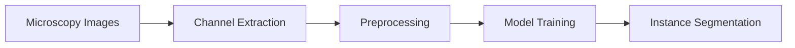
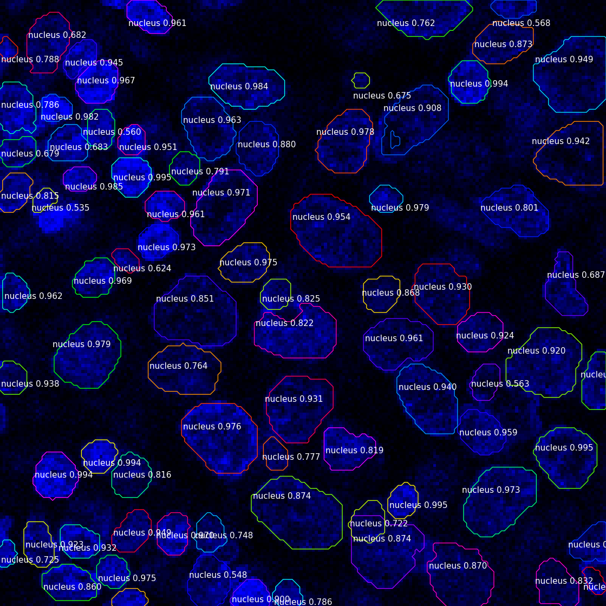

--- 
icon: lucide/package-check
--- 

# Instance Segmentation (Microscopy)

## Overview

Developed instance segmentation models to detect densely packed cells in 3D fluorescent microscopy images.

## Responsibilities

* Processed multi-channel microscopy data (DAPI channel)
* Implemented DCAN / Mask R-CNN models
* Handled high-density overlapping instances

## Approach

* Contour-aware segmentation (DCAN)
* Instance segmentation (Mask R-CNN)
* 3D-aware preprocessing

### Pipeline

### Tech

`TensorFlow` · `Mask R-CNN` · `DCAN`

## Impact

* Improved segmentation accuracy in dense cell environments
* Enabled quantitative biological analysis
* Reduced manual labeling effort

### Sample Result

