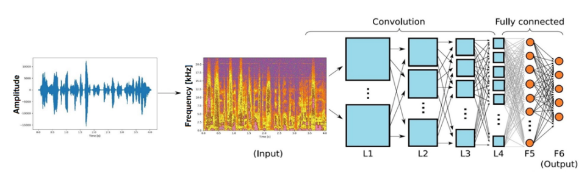
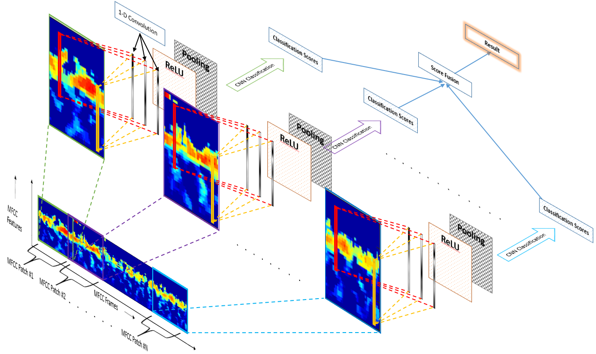

--- 
icon: lucide/package-check
--- 

# Speaker Recognition

## Overview

Built a speaker recognition system using cepstrum-based features and CNN models.

## Responsibilities

* Extracted MFCC/cepstrum features
* Designed CNN-based classification model
* Evaluated speaker identification accuracy

## Approach

* Audio preprocessing
* Feature extraction (MFCC)
* CNN-based classification

### Pipeline

  

## Tech

`PyTorch` · `Audio Processing` · `CNN`

## Impact

* Enabled accurate speaker identification
* Built foundation for voice-based AI systems

