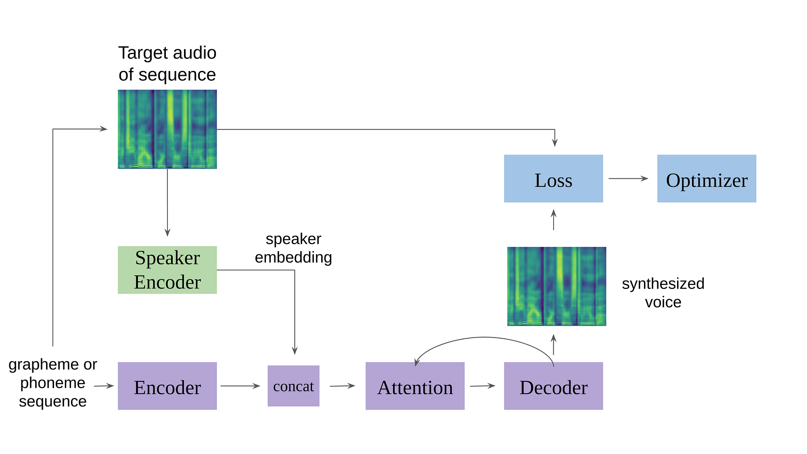
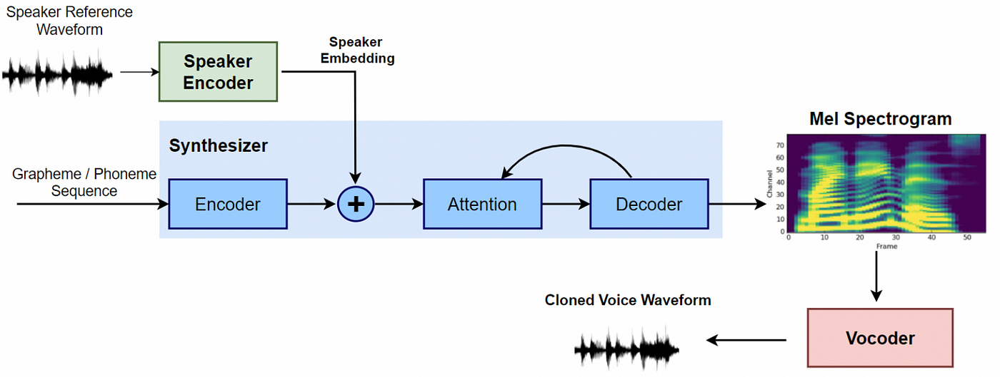
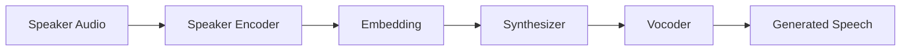

--- 
icon: lucide/package-check
--- 

# Voice Clone TTS

## Overview

Implemented a real-time voice cloning system based on SV2TTS architecture.

## Responsibilities

* Integrated open-source voice cloning model
* Processed speaker embeddings
* Generated natural-sounding speech

## Approach

* Speaker encoder
* Synthesizer (Tacotron-like)
* Vocoder

### Pipeline

  

## Tech

`PyTorch` · `TTS` · `SV2TTS`

## Impact

* Enabled realistic voice cloning
* Demonstrated multi-stage deep learning pipeline
* Expanded into generative audio systems

