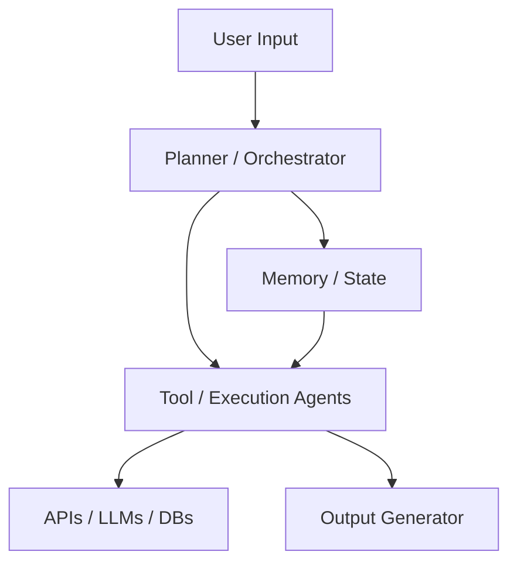
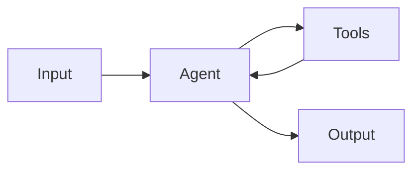
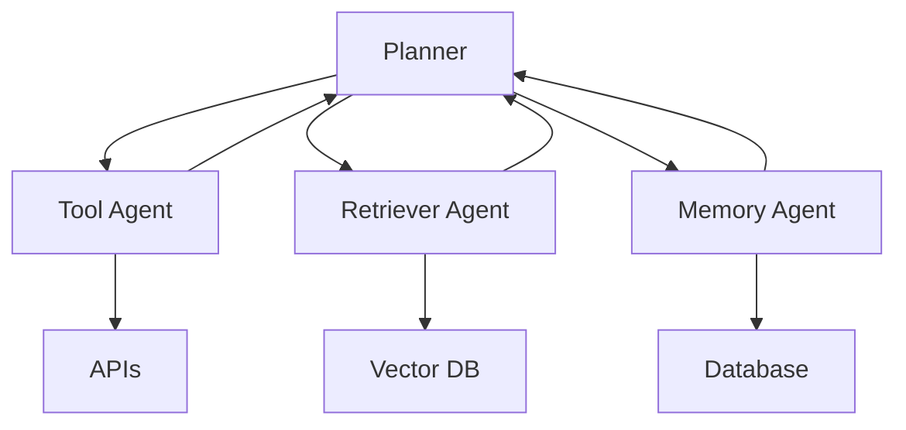
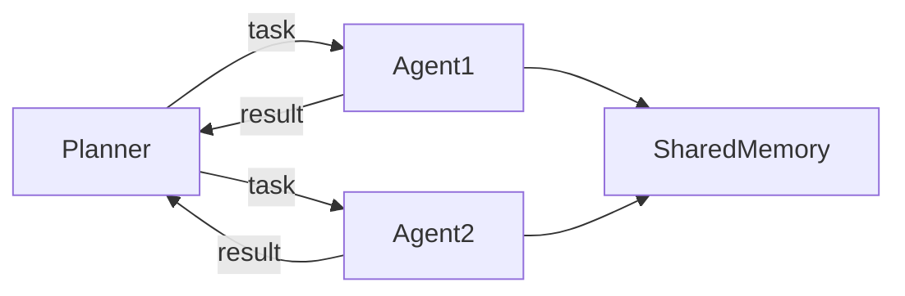
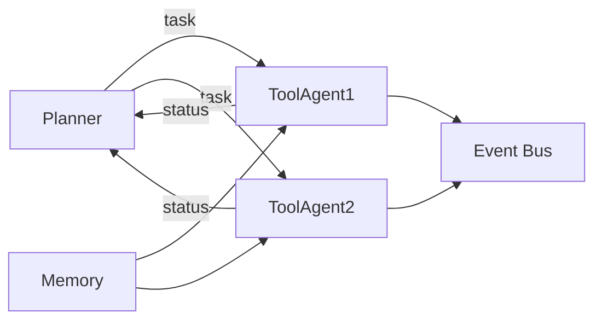
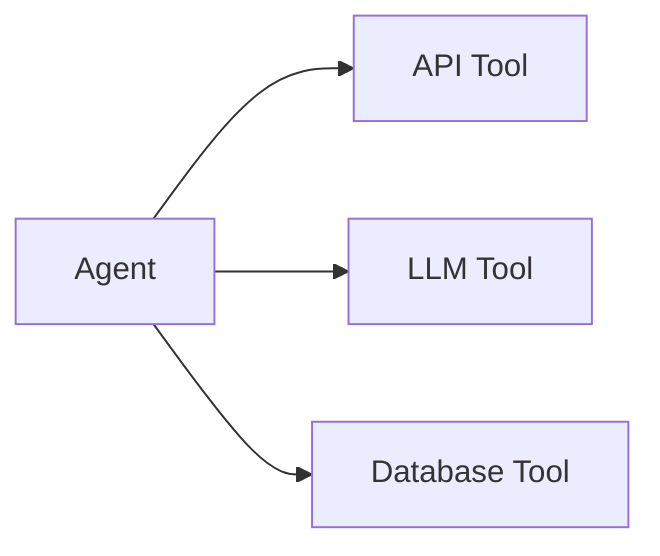
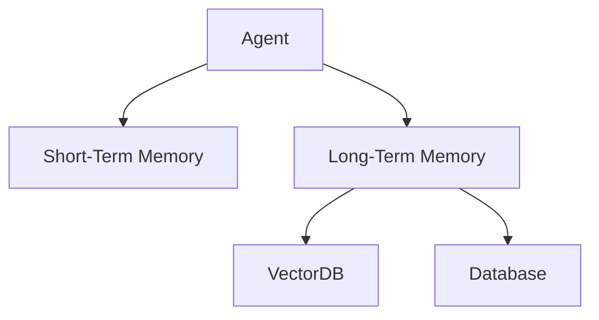
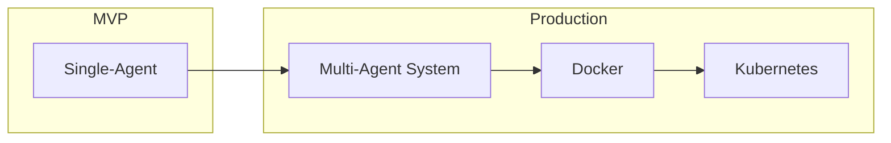
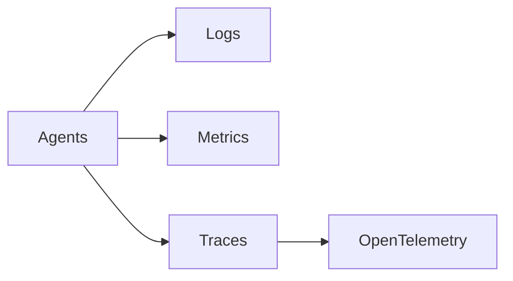

--- 
icon: lucide/panel-left-dashed
--- 

# :lucide-panel-left-dashed: AI Agent System Architecture

## 🧠 Overview

A comprehensive guide to designing **AI agent systems**, covering:

- Single-agent pipelines  
- Multi-agent architectures  
- Tool integration and orchestration  
- Memory and state management  
- Scaling and deployment  

## ⚖️ Core Design Principles

- **Simplicity first** → start with single-agent  
- **Modularity** → separate planner, tools, memory  
- **Observability** → logs, metrics, tracing  
- **Resilience** → retries, fallbacks, error handling  
- **Scalability** → evolve into distributed systems when needed  

## 🏗️ High-Level Architecture

### Components

* **Planner / Orchestrator**

    * task decomposition
    * decision making

* **Tool / Execution Agents**

    * API calls
    * LLM interactions
    * external tools

* **Memory / State**

    * short-term (conversation)
    * long-term (vector DB, storage)

* **Output Generator**

    * response formatting
    * final output

## 🧩 Single-Agent Architecture

### Characteristics

* centralized logic
* simple pipeline
* easy to debug

👉 Best for:

* MVPs
* simple assistants
* small systems

## 🤖 Multi-Agent Architecture

### Agent Roles

* **Planner Agent** → task decomposition
* **Tool Agent** → execution
* **Retriever Agent** → RAG / search
* **Memory Agent** → state management

👉 Best for:

* complex workflows
* scalable systems
* AI pipelines

## 🔗 Communication & Coordination

### Patterns

* **Direct messaging** → simple, low latency
* **Event bus (Pub/Sub)** → scalable, decoupled
* **Shared memory** → fast but needs synchronization

## ⚙️ Tool Integration Layer

* Tool calling = execution mechanism
* Functions = implementation detail

👉 Tools can include:

* REST APIs
* vector databases
* LLM APIs
* internal services

## 🧠 Memory Architecture

### Types

* **Short-term**

    * conversation context

* **Long-term**

    * embeddings (RAG)
    * structured storage

## 🚀 Scaling & Deployment

### Strategy

1. Start with **single-agent MVP**
2. Introduce **multi-agent separation**
3. Containerize with **Docker**
4. Scale with **Kubernetes**

## 📊 Observability (Critical)

* Logging → debugging
* Metrics → performance
* Tracing → request flow

👉 Required for:

* multi-agent debugging
* production systems

## 🧪 Best Practices

* start simple (single-agent)
* avoid premature multi-agent
* define **clear agent roles**
* design **stateless agents when possible**
* implement **retry + fallback logic**
* log every agent interaction

## ⚠️ Common Pitfalls

* over-engineering with too many agents
* tight coupling between agents
* lack of observability
* unclear responsibility boundaries

## 🏁 Final Architecture Strategy

* **Phase 1** → Single-Agent MVP
* **Phase 2** → Modular components
* **Phase 3** → Multi-Agent system
* **Phase 4** → Distributed + scalable

## 💬 My Take

> Start simple → evolve complexity

* Single-agent is enough for most systems
* Multi-agent is powerful but expensive (complexity)

For modern AI systems:

> Architecture should evolve with real needs, not assumptions

