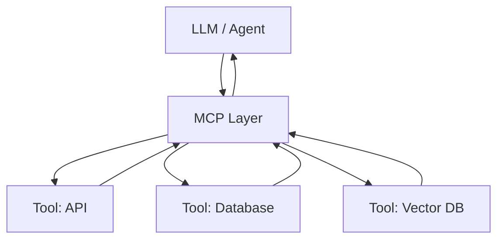
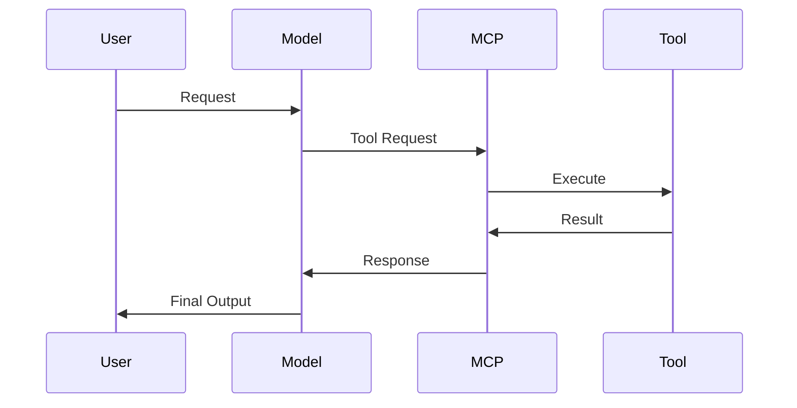
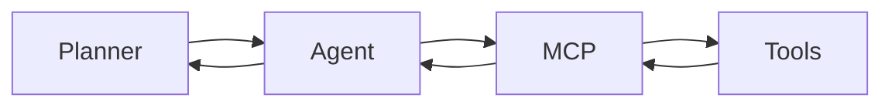

--- 
icon: lucide/panel-left-dashed
--- 

# :lucide-panel-left-dashed: Model Context Protocol (MCP)

## 🧠 Overview

**Model Context Protocol (MCP)** is a standardized way for AI models to interact with external tools, data sources, and systems.

- Defines how **models access context**  
- Enables **tool usage and system integration**  
- Standardizes communication between **LLMs and external services**  

## ⚖️ Why MCP Matters

Without MCP:  

- ad-hoc tool integrations  
- inconsistent APIs  
- hard-to-scale agent systems  

With MCP:  

- standardized tool interface  
- reusable integrations  
- scalable agent architecture  

👉 MCP is a **foundation for production AI agents**

## 🏗️ MCP Architecture

### Components

* **Model / Agent**

    * reasoning
    * decision making

* **MCP Layer**

    * protocol interface
    * tool registry
    * execution handler

* **Tools**

    * APIs
    * databases
    * services

## 🔧 How MCP Works

### Flow

1. User sends request
2. Model decides to use a tool
3. MCP routes the request
4. Tool executes
5. Result returned via MCP
6. Model generates final output

## 🔗 MCP vs Tool Calling

| Aspect          | Tool Calling  | MCP          |
| --------------- | ------------- | ------------ |
| Scope           | Model-level   | System-level |
| Standardization | Limited       | Strong       |
| Abstraction     | Function/tool | Protocol     |
| Scalability     | Moderate      | High         |

👉 MCP = **standardized tool calling layer**

## 🧩 MCP in AI Agent Systems

### Role in architecture

* decouples agents from tools
* enables reusable integrations
* simplifies multi-agent systems

## ⚙️ MCP vs Direct Integration

### Direct Tool Integration

* tightly coupled
* hard to maintain
* duplicated logic

### MCP-Based Integration

* centralized tool management
* reusable tools
* cleaner architecture

👉 MCP improves **maintainability + scalability**

## 🚀 Use Cases

* AI agents with multiple tools
* RAG systems (vector DB access)
* enterprise AI platforms
* multi-agent orchestration

## 🧪 Best Practices

* define clear tool schemas
* keep MCP layer lightweight
* log all tool interactions
* validate inputs/outputs
* handle failures gracefully

## ⚠️ Common Pitfalls

* over-complicating MCP layer
* poor tool schema design
* lack of observability
* tight coupling with specific tools

## 🏁 Key Takeaways

* MCP standardizes **model ↔ tool interaction**
* improves **scalability and maintainability**
* critical for **agent-based systems**

## 💬 My Take

👉 MCP is a **missing layer in many AI systems**

👉 It becomes essential when:

* tools grow
* agents scale
* systems become complex

For modern AI architecture:

> MCP turns tool usage from ad-hoc integration into a structured system

